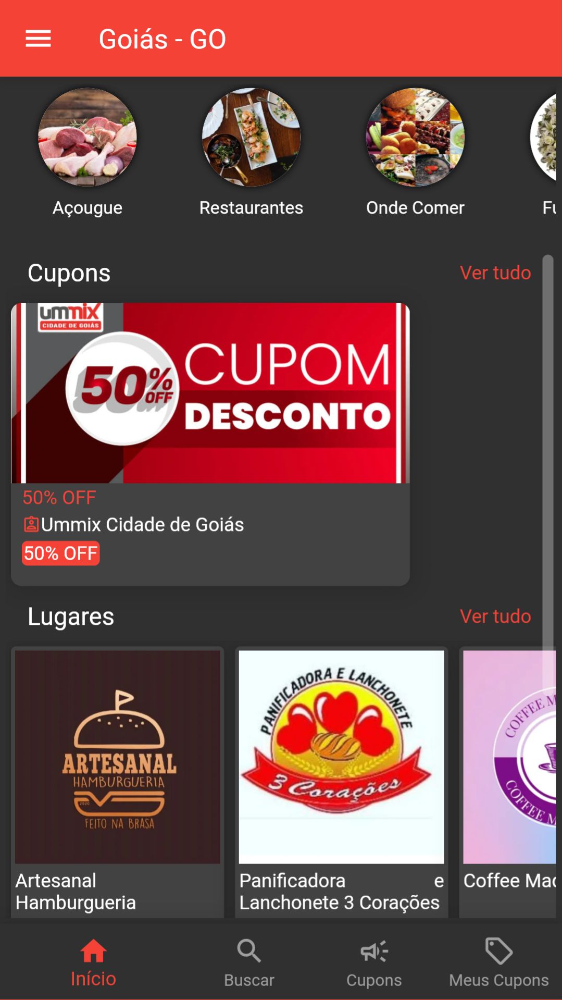
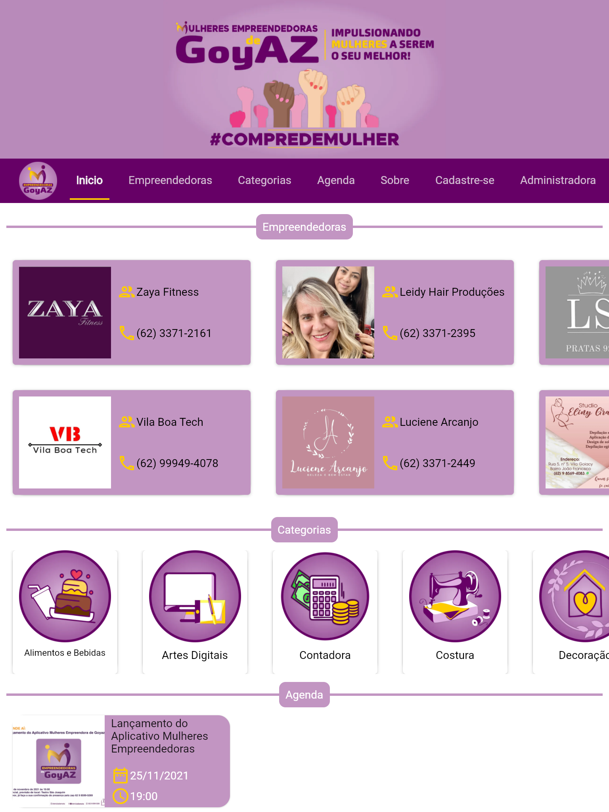

# Olá 👋

## Bem vindo(a) ao meu Github!

## Sobre mim
Sou bacharel em Sistemas de Informação e estou iniciando a carreira de desenvolvedor.
Descobri o universo da programação em meados de 2016, quando montava arquivos em lotes por diversão. 
Em 2017, quando iniciei o curso de Sistemas de Informação, passei a compreender como a aplicação do raciocínio lógico era fundamental nesse meio, foi quando descobri a existência de estruturas condicionais, de repetição e afins. Percebi que eu era muito bom nisso e sempre conseguia desenvolver e entregar códigos mais completos e bem elaborados.
Iniciei os estudos com HTML e Portugol (Pascal traduzido para português), depois fui avançando para C, C++, PHP, SQL, JavaScript e Java. Sempre andei um passo a frente e, mesmo diante de alguns obstáculos, tive ótimos resultados. No meu TCC, utilizei tecnologias que não foram vistas durante a formação (Node.js e ReactJS) e consegui alcançar todos os objetivos, desde o front-end até o back-end e o deploy, sendo aprovado com nota máxima.
Terminei a faculdade no forte da pandemia da COVID-19 e tudo estava muito incerto. Até que em março de 2021 fui convidado para desenvolver o back-end de um aplicativo de guia comercial. A partir de então, evolui muito como desenvolvedor, utilizando sempre as melhores práticas e evoluindo significamente a cada novo projeto. Durante esse período também refinei meus conhecimentos no Flutter, pois era uma tecnologia que eu havia tido apenas um contato superficial em meados de 2019 e era algo que eu queria muito aprender.
Em agosto de 2022 finalmente iniciei minha carreira formal como desenvolvedor, que desde o primeiro momento tem me agregado muito tanto pessoalmente quanto profissionalmente.

## Trabalho
Iniciei minha carreira como freelancer em desenvolvimento de sites, aplicativos e web services.

Atualmente sou desenvolvedor full-stack na [DEVOZ](https://devoz.com.br/).

## Principais hard skills

### Em segundo plano atualmente:

## Quero aprender:

## Hobbies 

## Estatísticas

 

## Apps desenvolvidos:
  

  ### Guia Ummix Cidade de Goiás
   

  
  ### Idealizado para que que os anunciantes da cidade de Goiás possam se inscrever a fim de divulgar seu negócio e disponibilizar cupons de desconto que poderão ser adquiridos pelos usuários do app. 
   
    

 
  

  ### Mulheres Empreendedoras de Goyaz
   

  
  ### Desenvolvido para a apresentação dos perfis das mulheres empreendedoras do município de Goiás. Uma iniciativa da vereadora Elenízia da Mata para oferecer maior visibilidade ao negócio das empreendedoras que estiverem interessadas em criar o seu perfil na plataforma.
   
    

 
  

  ### App Minha Loja - Amanda Modas
   

  
  ### Construído para possibilitar a divulgação de produtos oferecidos por pequenas e médias lojas, dos mais diversos segmentos. Com ele, é possível organizar os produtos através de coleções e categorias. Os clientes poderão adicionar os produtos ao carrinho e efetuar pedidos para então serem redirecionados para o WhatsApp para a negociação de pagamentos e retiradas. Este é um app modular, que será integrado com novas funcionalidades de acordo com as necessidades dos nossos clientes.
   
   
## Contato: 
 
 
 
 
